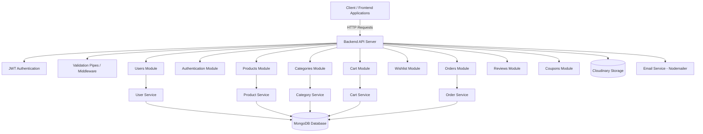
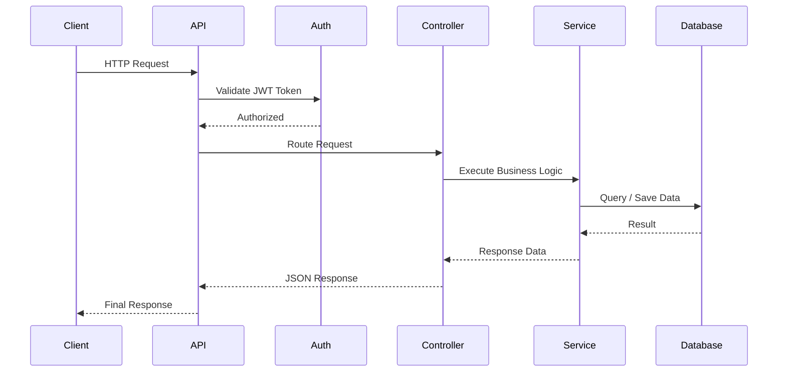
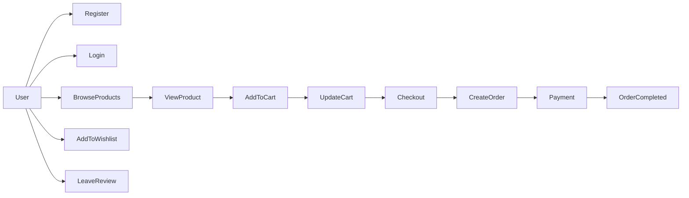
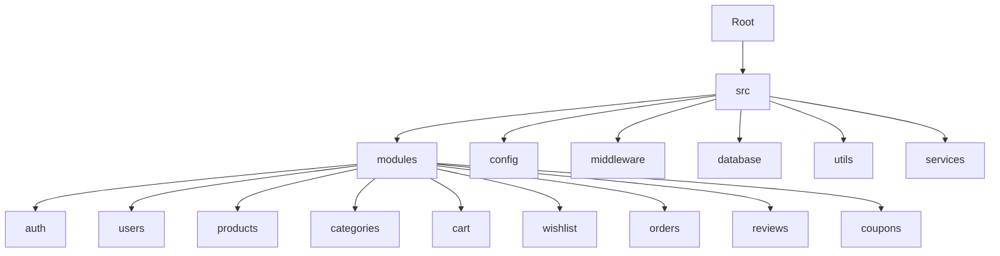

# 🛒 Fresh Cart API

Fresh Cart is a **scalable E-Commerce RESTful API** built with **Node.js and modern backend architecture**.
The system handles authentication, product management, carts, orders, reviews, and payments while integrating external services for storage and email notifications.

---

# 🧱 System Architecture

This diagram explains the **core backend architecture**, showing how requests flow from the **client to modules, services, and database**.

---

# 🔄 API Request Flow

This flow describes how the system processes **incoming requests and responses**.

---

# 🛍️ E-Commerce User Flow

This diagram shows the **typical user journey** in the system.

---

# 📦 Project Structure

The project follows a **modular backend architecture** for scalability and maintainability.

---

# ⚙️ Tech Stack

### Backend

* Node.js
* Express.js / NestJS
* TypeScript

### Database

* MongoDB
* Mongoose ORM

### Authentication & Security

* JWT Authentication
* Bcrypt Password Hashing
* Authorization Guards

### File Handling

* Multer
* Cloudinary

### Email System

* Nodemailer

### Validation

* Class Validator
* Validation Pipes

---

# 🔐 Security Features

* Password hashing using **bcrypt**
* Secure authentication with **JWT**
* Role-based authorization
* Request validation
* Protected routes using guards and middleware

---

# 📡 API Documentation

Full API documentation is available via Postman:

https://documenter.getpostman.com/view/42697493/2sB3WsMywv

---

# 🚀 Key Features

* User Authentication & Authorization
* Product & Category Management
* Shopping Cart System
* Wishlist System
* Orders & Checkout
* Reviews & Ratings
* Coupons & Discounts
* Image Uploads (Cloudinary)
* Email Notifications

---

# 🎯 Purpose of the Project

This project demonstrates **real-world backend architecture for scalable E-commerce systems**, including:

* Modular system design
* REST API best practices
* Secure authentication
* Database relationships
* External service integrations

---

# 📬 Contact

If you have any questions or suggestions, feel free to reach out.
